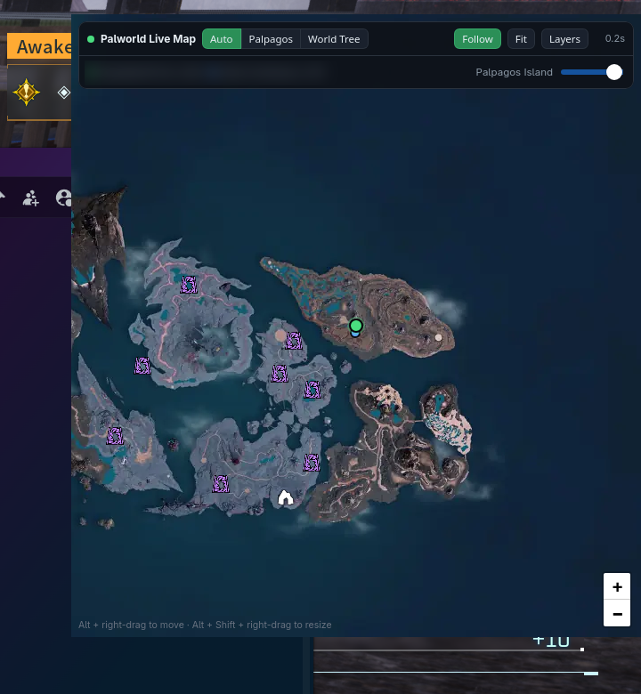

# Palworld Live Map — a real in-game overlay for Linux

Live player position from your Palworld **dedicated server**, drawn *over* the
game — including a fullscreen game — on Wayland. Palpagos Island and The World
Tree, with every dungeon, rift, tower, effigy, chest and Pal spawn on
toggleable layers.



Overwolf has no Linux build, and the TH.GL Companion App is Windows-only, so
this is a native replacement built from the pieces Linux actually gives you.

---

## What you get

- **Live position** for you and everyone else online, updating about once a
  second, with a marker on the map and a player list
- **All 164 maps** — Palpagos Island, The World Tree, and every dungeon
  interior. `Auto` picks the most specific map containing your coordinates, so
  **walking into a dungeon switches the overlay to that dungeon's own map** and
  leaving switches back
- **All 504 location types** in 12 groups: 155 dungeons, 12 sealed dungeons,
  8 dimensional rifts, 137 fast travels, 106 hackable towers, 140 Lifmunk
  effigies, 1459 chests, 86 Alpha Pals, ore veins, fishing spots, NPCs…
  Dungeons are on by default; there is a search box for the rest
- **Navigation readouts** — distance and compass bearing to the nearest
  enabled marker, and to a waypoint you drop with Shift+click
- **Live server status** — in-game day, players online, base camps, server FPS,
  frame time and uptime
- **Minimap mode** — one click shrinks it to a compact 340×340 follow-cam
- **A true overlay**, not a second window: it draws above fullscreen, and
  keyboard input keeps going to the game until you click the map
- **Alt + right-drag** to move it, **Alt + Shift + right-drag** to resize

## Requirements

**A Wayland compositor that implements `zwlr_layer_shell_v1`.** This is the
whole trick — a normal always-on-top window *cannot* cover a fullscreen game,
because fullscreen windows sit in a higher layer. Check yours:

```sh
wayland-info | grep zwlr_layer_shell
```

| Compositor | Works |
|---|---|
| KWin (Plasma 5.27+, 6.x) | yes — developed against this |
| sway, Hyprland, river, Wayfire | yes (layer-shell native) |
| GNOME / Mutter | **no** — Mutter does not implement wlr-layer-shell |
| any X11 session | **no** |

**A Palworld dedicated server you administer**, with the REST API enabled. The
API is the position source; there is no way to get live position out of
single-player or invite-code co-op. See
[Getting REST API access](#getting-rest-api-access).

**Packages:**

```sh
# Arch / CachyOS / Manjaro
sudo pacman -S --needed gtk3 gtk-layer-shell webkit2gtk-4.1 python-gobject \
                        nodejs npm curl imagemagick

# Debian / Ubuntu
sudo apt install python3-gi gir1.2-gtk-3.0 gir1.2-webkit2-4.1 \
                 gir1.2-gtklayershell-0.1 nodejs npm curl imagemagick

# Fedora
sudo dnf install python3-gobject gtk3 gtk-layer-shell webkit2gtk4.1 \
                 nodejs npm curl ImageMagick
```

Nothing else — the local server is Python **stdlib only**, no pip packages, no
virtualenv. Node is used once at install time to decode the map data.

## Install

```sh
git clone https://github.com/FunFighter/palworld-overlay-linux.git
cd palworld-overlay-linux
./scripts/install.sh
```

The installer checks prerequisites, copies the app to
`~/.local/share/palworld-live-map`, fetches Leaflet and the map data, installs
a launcher plus a systemd user unit, and registers `Meta+P` on KDE. It is
idempotent — re-run it to update.

> The repo is `palworld-overlay-linux`, but it installs under the shorter
> `palworld-live-map` name — that is the data directory, the `systemd --user`
> unit and the `journalctl` unit name throughout this README.

Then set your credentials:

```sh
$EDITOR ~/.local/share/palworld-live-map/config.json
```

```json
{
  "rest_url": "http://127.0.0.1:8212",
  "rest_user": "admin",
  "rest_pass": "your-AdminPassword",
  "me": "YourInGameCharacterName",
  "listen_port": 8765,
  "poll_ms": 1000
}
```

`me` must match the `name` field from `/v1/api/players` exactly — that is your
**character** name, not your Steam name. Check it with:

```sh
curl -s -u admin:PASSWORD http://127.0.0.1:8212/v1/api/players
```

Start it:

```sh
systemctl --user enable --now palworld-live-map
```

Press **Meta+P**, or run `palworld-overlay`.

## Getting REST API access

On the server, in `PalWorldSettings.ini`:

```ini
RESTAPIEnabled=True
RESTAPIPort=8212
AdminPassword="something-long"
```

The API uses HTTP Basic auth as user `admin`. **Never expose port 8212 to the
internet** — it can shut the server down. Three cases:

**1. Server on this machine** — nothing to do, `http://127.0.0.1:8212` works.

**2. Another host on your LAN** — tunnel it rather than opening the port:

```sh
ssh -N -L 127.0.0.1:8212:127.0.0.1:8212 user@server-host
```

**3. In Docker with the port unpublished** (common, and correct) — the API
listens on `0.0.0.0:8212` *inside* the container. Reach it over the Docker
bridge from the host, so you never have to republish a port or restart the
container:

```sh
docker inspect -f '{{range .NetworkSettings.Networks}}{{.IPAddress}}{{end}}' palworld-server
# -> 172.18.0.2
ssh -N -L 127.0.0.1:8212:172.18.0.2:8212 user@server-host
```

To make the tunnel permanent, install the example unit (it needs key auth):

```sh
cp systemd/palworld-rest-tunnel.service.example \
   ~/.config/systemd/user/palworld-rest-tunnel.service
$EDITOR ~/.config/systemd/user/palworld-rest-tunnel.service   # set USER@HOST, CONTAINER_IP
ssh-copy-id -i ~/.ssh/id_ed25519.pub user@server-host
systemctl --user enable --now palworld-rest-tunnel
```

## Controls

| | |
|---|---|
| `Meta+P` | show / hide the overlay |
| **×** (top right) | close the overlay; reopen with `Meta+P` or the menu entry |
| **Alt + right-drag** | move the box |
| **Alt + Shift + right-drag** | resize the box |
| `Auto` / `Palpagos` / `World Tree` | map selection; Auto follows the map you are on |
| `Follow` | keep the view centred on you |
| `Fit` | zoom out to the whole map |
| `Layers` | type toggles, with search and a "Dungeons only" preset |
| `Mini` | compact 340×340 minimap mode |
| **Shift + click** | drop a waypoint; the nav row shows distance and bearing |
| opacity slider | bottom-right of the panel |

The nav row also shows the nearest enabled marker with a bearing arrow — click
it to jump the view there — plus your raw coordinates and a metre scale bar.

If your coordinates fall outside every known map you get an **off-map** badge
(usually a loading screen or an unmapped instance). If you are inside the map
bounds but past the edge of the drawn tiles — far out to sea, or high above it —
you get **off the drawn map** with the distance back to the nearest feature,
rather than an unexplained black square.

Position, size and layer choices persist across restarts.

The × stays visible in Mini mode, where the other controls are hidden, so you
can always get out of it.

If the server becomes unreachable the header shows `offline` and the status row
dims and reads "last known values" — the figures shown are the last ones
received, never presented as live.

## How it works

```
Palworld (Proton, fullscreen)
        ▲  layer-shell OVERLAY surface draws above it
overlay.py   GTK3 + WebKit2 + gtk-layer-shell
        ▲  http://127.0.0.1:8765
server.py    local UI + REST proxy   (systemd --user)
        ▲  /v1/api/players
Palworld dedicated server
```

`server.py` polls the game server once and fans the result out to any number of
page clients, so the admin password never reaches the browser and the server
sees one poller regardless of how many times you reopen the overlay.

**Coordinates need no calibration.** TH.GL publishes each map's Leaflet
transformation and bounds *in raw game coordinates* — the same frame
`location_x` / `location_y` are reported in — so `L.latLng(location_x,
location_y)` under that CRS is exact:

| map | bounds (lat = x, lng = y) |
|---|---|
| Palpagos Island | `[[-1099399, -724399], [349399, 724399]]` |
| The World Tree | `[[347352.5, -818196], [689147.5, -476401]]` |

Those boxes are effectively disjoint, which is what makes `Auto` map switching
work. Beware of stale advice: the 2024-era origins that circulate for Palworld
(`originX=122500`, `originY=-158100`, `ratio=458.355`) do **not** fit a v1.0
world and will put your marker off-map.

## Updating map data after a game patch

```sh
cd ~/.local/share/palworld-live-map/tools && node fetch_data.mjs
```

That pulls **all 164 maps** (about 4 MB and a minute or two). Pass a comma
separated list to limit it — `node fetch_data.mjs default,tree` — though you
lose dungeon-interior switching if you do.

Node data is loaded lazily at runtime: only the map you are currently looking
at is fetched into the page, so 164 maps costs nothing at startup.

## Troubleshooting

**The overlay starts and instantly dies.** Look for
`wp_linux_drm_syncobj_surface_v1` error 4, *"explicit sync is used, but no
acquire point is set"*. That is a GTK3/Mesa-vs-KWin bug on the accelerated
path. The launcher already sets `WEBKIT_DISABLE_COMPOSITING_MODE=1` to avoid
it; if you run `overlay.py` by hand, set it too. It also keeps the GPU free for
the game.

**The overlay appears but the game covers it.** Either your compositor has no
layer-shell (see the table above), or GTK picked the X11 backend.
`GDK_BACKEND=wayland` must be set **before** PyGObject imports Gtk — `overlay.py`
does this at the top of the file, above `import gi`, and moving it lower
silently degrades to a normal window.

**Status dot is red / "offline".** The REST proxy cannot reach the game server:

```sh
curl -s -u admin:PASSWORD http://127.0.0.1:8212/v1/api/info
journalctl --user -u palworld-live-map -n 30
```

**Player list is populated but no marker for you.** `me` in `config.json` does
not match your character name, or you are on a map whose bounds do not contain
you — dimmed dots in the player list mean "online but not on this map".

**Service restart-loops with "Address already in use".** Something else holds
`listen_port`. Find it with `ss -tlnp | grep 8765` and stop it; a stray
hand-started `server.py` is the usual culprit.

**WASD stops working while the overlay is up.** Click the game to give it focus
back. Keyboard mode is `ON_DEMAND`, so the overlay only takes the keyboard once
you click it. Use `--click-through` to make it ignore the pointer entirely.

## Limitations, honestly

- **~1 Hz position**, not 60 Hz, and **no facing direction** — that is all the
  REST API exposes. Real-time position and heading would require reading the
  game client's memory, which is what the Windows companion app does through
  its own kernel driver.
- **No live "active dungeon" filter.** The map shows all 155 dungeon entrances,
  not just the ones currently spawned. The server does know — `Level.sav` holds
  145 live dungeon instances with types, boss states and respawn timers — but it
  stores no coordinates and no key that joins to an entrance, so the active set
  cannot be placed on a map. In practice ~145 of 155 are open at any moment, so
  showing all of them is within about 6% of the truth. See
  [docs/NOTES.md](docs/NOTES.md).
- **No live nearby-Pal tracking**, for the same reason.
- Single-player and invite-code co-op are **not supported** — there is no API.

## Uninstall

```sh
./scripts/uninstall.sh           # keeps config.json
./scripts/uninstall.sh --purge   # removes everything
```

## Credits and data provenance

Map tiles, location data and marker icons come from
[The Hidden Gaming Lair](https://www.th.gl) (`th.gl`) and are fetched at
install time — **this repository redistributes none of it**. If you find this
useful, their Windows companion app and site are worth supporting.

[Leaflet](https://leafletjs.com) is fetched at install time (BSD-2-Clause).
Palworld is © Pocketpair. This project is unaffiliated with Pocketpair,
Overwolf and TH.GL.

`tools/ooz/` documents building an Oodle/Kraken decompressor for reading
Palworld v1.0 `PlM1` save files. It is not needed for the map and ships no
binary — see its README.

Licensed MIT. See [LICENSE](LICENSE).
